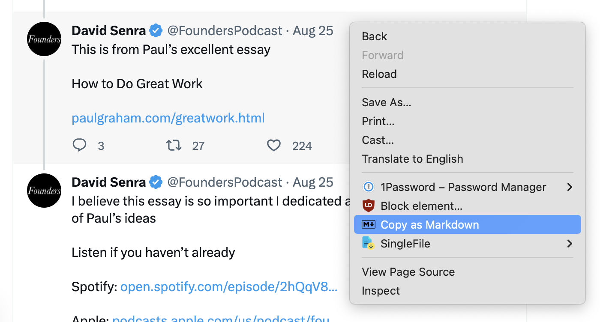

# X Post to Markdown Chrome Extension

This Chrome extension allows you to copy posts from x.com as markdown. You can just right click on a given post and select "Copy as Markdown".

## Installation

1. Download the repo
2. Open Chrome and select "Manage Extensions..."
3. Activate "Developer mode" (top right corner)
4. Click on "Load unpacked" and select this project

## Example

Right click on a post and select "Copy as Markdown"



And paste it wherever you need it

```markdown
**David Senra**
[@FoundersPodcast](https://twitter.com/FoundersPodcast)
2023-08-25T14:29:34

> This is from Paul’s excellent essay
> 
> How to Do Great Work 
> 
> [http://paulgraham.com/greatwork.html](https://t.co/zlvWAWRYm3)

[Source](https://twitter.com/FoundersPodcast/status/1695080986256531964)
```

## Limitations

The extension doesn't support retweets, threads and embedded videos.
